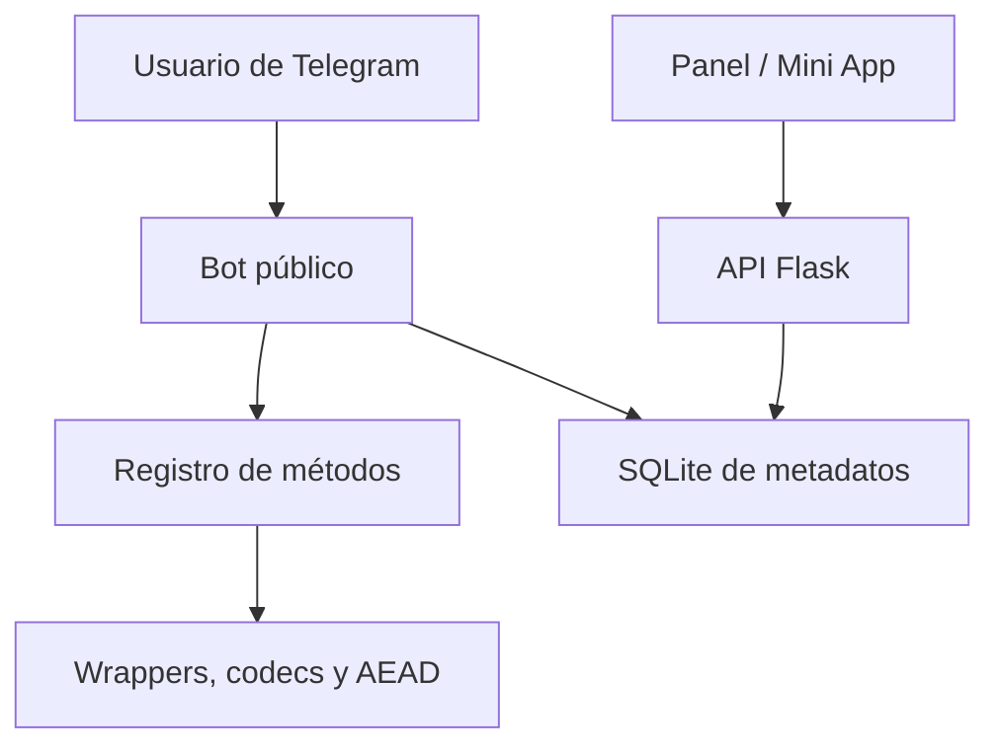

# Arquitectura

## Componentes

- `codecipher.bot`: flujos conversacionales, comandos, límites, difusiones y
  permisos administrativos.
- `codecipher.registry`: contrato único para cada método. Evita diferencias
  entre interfaces.
- `codecipher.runnable`: genera wrappers ejecutables y los recupera mediante
  análisis estático.
- `codecipher.security`: contenedores autenticados `GCB2` (AES-GCM) y `GCB3`
  (ChaCha20-Poly1305).
- `codecipher.batch`: transforma proyectos ZIP en memoria manteniendo rutas.
- `codecipher.tools`: codecs, compresión limitada, hashes, QR, Ed25519,
  detección y análisis.
- `codecipher.storage`: usuarios, operaciones, presets, configuración, códigos
  de acceso y auditoría. Nunca contenido.
- `codecipher.web`: estado público, autenticación Telegram/código y acciones
  administrativas.

## Flujos de seguridad

### Protección ejecutable

1. Se valida tamaño y rate limit.
2. Se detecta el runtime por la extensión.
3. La fuente UTF-8 se codifica en memoria.
4. Se devuelve un cargador del mismo tipo de archivo.
5. Para recuperar, el backend extrae el literal Base64 mediante una expresión
   acotada; no inicia el runtime.

### Cifrado real

1. PBKDF2-HMAC-SHA256 deriva 256 bits desde contraseña y salt aleatorio.
2. AES-GCM o ChaCha20-Poly1305 cifra nombre y contenido.
3. El magic del contenedor se autentica como AAD.
4. El descifrado verifica el tag antes de exponer cualquier byte.

### Panel

La Mini App entrega `initData`; el backend valida su HMAC, fecha e identidad.
También existe un código administrativo aleatorio, almacenado como SHA-256, de
un solo uso y cinco minutos. La API emite sesiones firmadas de una hora.

## Escalado

Una instancia funciona con polling y SQLite. Para alta disponibilidad:

1. usa webhook;
2. sustituye SQLite por una base compartida;
3. usa una cola para difusiones y tareas pesadas;
4. guarda límites de tasa en un almacén compartido;
5. despliega varias réplicas detrás de HTTPS.

